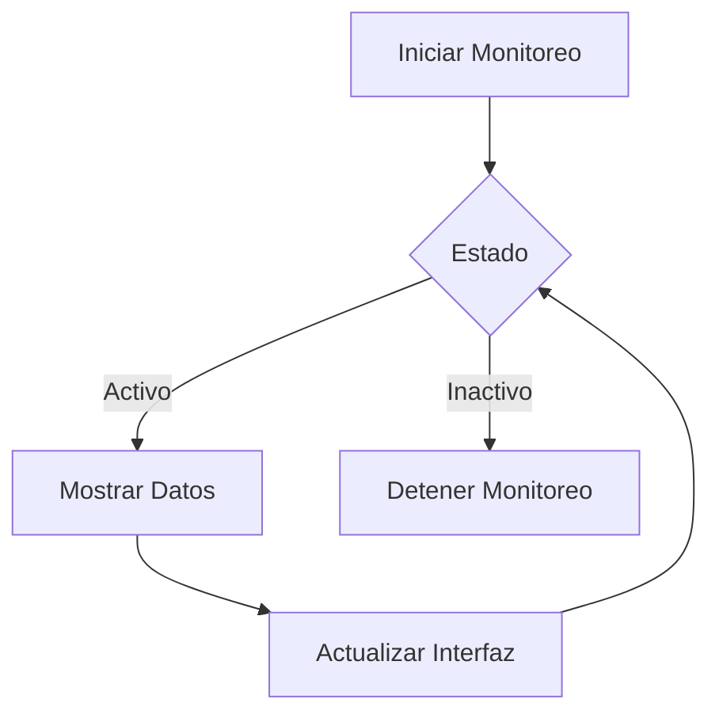

<div align="center">
  <h1>🚀 Guía Rápida de Uso</h1>
  <p>Descubre cómo sacar el máximo provecho a tu herramienta de escaneo de red</p>
  <hr>
</div>

## 📡 Escaneo de Red

### Tipos de Escaneo Disponibles

| Tipo de Escaneo | Descripción | Icono |
|----------------|-------------|-------|
| **Rápido** | Escaneo básico de la red local | ⚡ |
| **Completo** | Análisis exhaustivo de dispositivos y puertos | 🔍 |
| **Personalizado** | Configuración avanzada de parámetros | ⚙️ |

### Cómo Realizar un Escaneo

1. **Selecciona** el tipo de escaneo
2. **Configura** los parámetros (si es necesario)
3. **Inicia** el escaneo
4. **Espera** a que se complete el análisis
5. **Revisa** los resultados

## 📱 Gestión de Dispositivos

<div style="display: grid; grid-template-columns: repeat(auto-fit, minmax(300px, 1fr)); gap: 1rem; margin: 1rem 0;">

### Añadir Dispositivo
```
Menú > Dispositivos > Agregar
```
Añade manualmente un dispositivo a la red.

### Editar Información
```
Menú > Dispositivos > Editar
```
Actualiza los detalles de un dispositivo existente.

### Eliminar Dispositivo
```
Menú > Dispositivos > Eliminar
```
Elimina un dispositivo de la lista.

</div>

## 📊 Monitoreo en Tiempo Real



### Características de Monitoreo

- 📈 Gráficos en tiempo real
- 🔔 Alertas personalizables
- 📋 Historial de eventos
- 📊 Métricas de rendimiento

## 💾 Exportación de Datos

### Formatos Soportados

| Formato | Uso Recomendado |
|---------|-----------------|
| **CSV** | Análisis en hojas de cálculo |
| **PDF** | Informes formales |
| **JSON** | Integración con APIs |

### Pasos para Exportar

1. **Selecciona** los datos a exportar
2. **Elige** el formato deseado
3. **Especifica** la ubicación de guardado
4. **Confirma** la exportación

## ⚙️ Configuración

### Ajustes Principales

- **Apariencia**
  - Tema claro/oscuro
  - Tamaño de fuente
  - Diseño personalizado

- **Red**
  - Tiempo de espera
  - Intentos de conexión
  - Puertos personalizados

- **Notificaciones**
  - Alertas por correo
  - Notificaciones del sistema
  - Sonidos de alerta

## 📱 Accesos Rápidos

| Atajo | Acción |
|-------|--------|
| `Ctrl + N` | Nuevo Escaneo |
| `Ctrl + E` | Exportar Datos |
| `F1` | Ayuda |
| `Esc` | Cancelar Operación |

<div align="center" style="margin-top: 2rem;">
  <hr>
  <p>¿Necesitas más ayuda? Consulta nuestro <a href="#">manual completo</a> o <a href="#">contacta al soporte</a>.</p>
</div>
