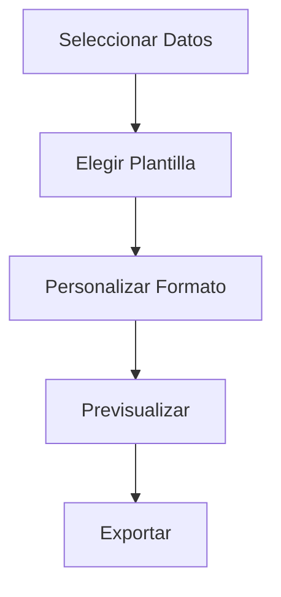

<div align="center">
  <h1>📚 Tutoriales Paso a Paso</h1>
  <p>Aprende a utilizar todas las funciones de la aplicación con nuestras guías detalladas</p>
  <hr>
</div>

## 📋 Tabla de Contenidos

1. [Primer Escaneo](#-1-primer-escaneo)
2. [Configurar Alertas](#-2-configurar-alertas)
3. [Generar Informes](#-3-generar-informes)
4. [Monitoreo en Tiempo Real](#-4-monitoreo-en-tiempo-real)
5. [Personalizar la Interfaz](#-5-personalizar-la-interfaz)

---

## 🎯 1. Primer Escaneo

### Objetivo
Realizar tu primer escaneo de red exitosamente.

### Pasos Detallados

1. **Iniciar la Aplicación**
   - Haz doble clic en el ícono del escritorio
   - O búscala en el menú de inicio

2. **Seleccionar Tipo de Escaneo**
   - Haz clic en el botón "Escaneo Rápido"
   - O selecciona "Nuevo Escaneo" en el menú principal

3. **Configuración Básica**
   ```
   Rango de IP: Automático (recomendado)
   Perfil: Rápido
   Opciones avanzadas: Predeterminado
   ```

4. **Iniciar el Escaneo**
   - Haz clic en "Iniciar Escaneo"
   - Espera a que se complete el proceso

5. **Revisar Resultados**
   - Dispositivos detectados
   - Estado de la red
   - Detalles de conexión

### Consejos
- Para redes domésticas, el escaneo rápido es suficiente
- Usa escaneo completo para análisis más detallados

---

## 🔔 2. Configurar Alertas

### Objetivo
Configurar notificaciones para eventos importantes.

### Pasos Detallados

1. **Acceder al Panel de Alertas**
   - Menú "Herramientas" > "Alertas"
   - O usa el atajo `Ctrl + Alt + A`

2. **Crear Nueva Regla**
   - Haz clic en "Nueva Regla"
   - Completa los campos requeridos:
     - **Nombre**: Identificador de la alerta
     - **Condición**: Cuando un dispositivo se conecta
     - **Acción**: Notificación del sistema

3. **Configurar Condiciones**
   ```yaml
   tipo: conexion_nueva
   direccion_ip: cualquier
   notificar_por: email, app
   ```

4. **Prueba la Regla**
   - Usa el botón "Probar"
   - Verifica que recibas la notificación

### Tipos de Alertas
- Conexiones nuevas
- Dispositivos desconocidos
- Umbral de ancho de banda
- Caídas de servicio

---

## 📄 3. Generar Informes

### Objetivos de Aprendizaje
- Crear informes personalizados
- Exportar en diferentes formatos
- Programar informes recurrentes

### Guía Visual



### Formatos Soportados

| Formato | Uso Recomendado | Tamaño Aprox. |
|---------|-----------------|---------------|
| PDF     | Informes formales | 500KB-2MB    |
| CSV     | Análisis de datos | 100KB-1MB    |
| HTML    | Visualización web  | 1-5MB        |


---

## 📈 4. Monitoreo en Tiempo Real

### Características Principales

- Panel de control interactivo
- Gráficos en tiempo real
- Alertas instantáneas
- Historial de eventos

### Cómo Empezar

1. **Iniciar Monitoreo**
   - Ve a la pestaña "Monitoreo"
   - Haz clic en "Iniciar"

2. **Personalizar Vista**
   - Añade/elimina widgets
   - Cambia el diseño
   - Guarda tu configuración

3. **Análisis de Datos**
   - Usa filtros para enfocarte
   - Exporta datos para análisis
   - Compara períodos

---

## 🎨 5. Personalizar la Interfaz

### Temas Disponibles

| Tema | Descripción |
|------|-------------|
| Claro | Ideal para entornos con mucha luz |
| Oscuro | Reduce la fatiga visual |
| Personalizado | Crea tu propio tema |

### Personalización Avanzada

1. **Colores**
   - Selecciona paletas predefinidas
   - Usa el selector de color personalizado
   - Ajusta la intensidad

2. **Fuentes**
   - Cambia el tipo de letra
   - Ajusta el tamaño
   - Modifica el espaciado

3. **Diseño**
   - Reorganiza los paneles
   - Guarda perfiles de diseño
   - Restablece a valores predeterminados

---

<div align="center" style="margin-top: 2rem;">
  <hr>
  <p>¿Necesitas ayuda adicional? Visita nuestro <a href="#">centro de soporte</a> o <a href="#">contacta a nuestro equipo</a>.</p>
</div>
