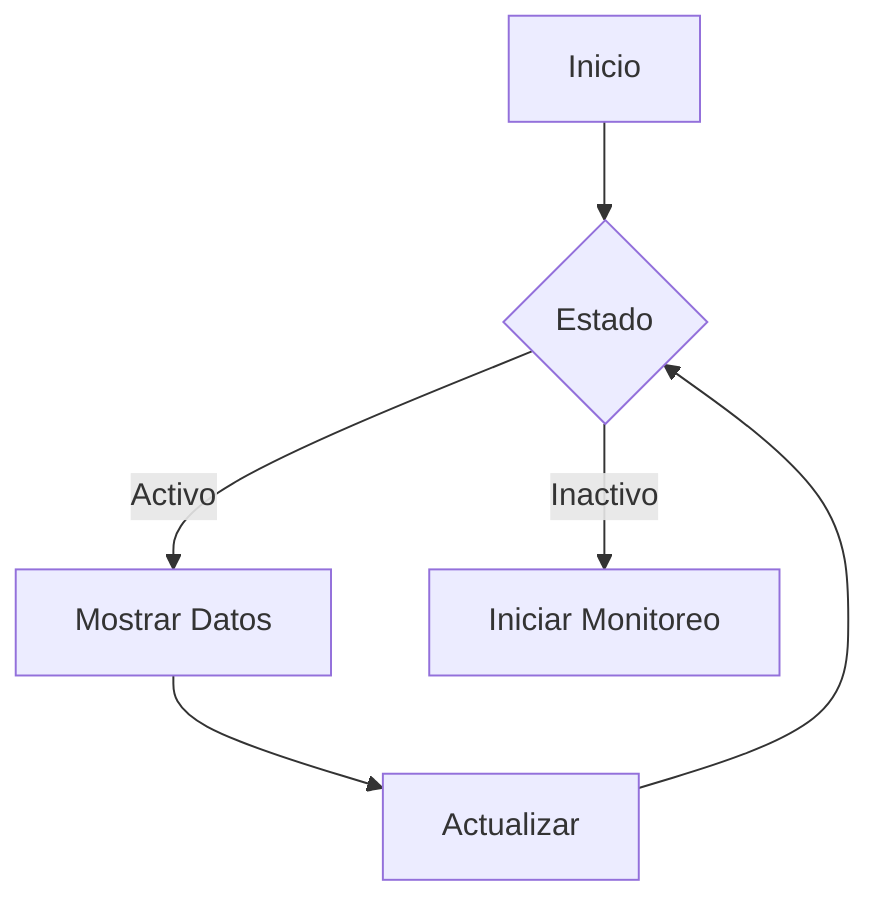

<div align="center">
  
  <h1>📘 Manual de Usuario</h1>
  <p>Guía Completa para el Uso de Network Scanner Pro</p>
  <p><em>Versión 2.0 | Última actualización: Junio 2023</em></p>
  <hr>
</div>

## 📑 Tabla de Contenidos

1. [Introducción](#-introducción)
2. [Requisitos del Sistema](#%EF%B8%8F-requisitos-del-sistema)
3. [Instalación](#-instalación)
4. [Primeros Pasos](#-primeros-pasos)
5. [Características Principales](#-características-principales)
6. [Solución de Problemas](#-solución-de-problemas)
7. [Preguntas Frecuentes](#%EF%B8%8F-preguntas-frecuentes)
8. [Soporte Técnico](#-soporte-técnico)

---

## 🌟 Introducción

Bienvenido a **Network Scanner Pro**, la solución todo en uno para el monitoreo y gestión de redes. Este manual te guiará a través de todas las funcionalidades de la aplicación, desde la instalación hasta el uso avanzado.

### ¿Qué puedes hacer con Network Scanner Pro?

- 🔍 **Escanear redes** de forma rápida y precisa
- 📊 **Monitorear** el estado de tu red en tiempo real
- 📑 **Generar informes** profesionales
- 🔔 **Recibir alertas** sobre eventos importantes
- 🛠️ **Gestionar dispositivos** de red de manera eficiente

---

## ⚙️ Requisitos del Sistema

### Requisitos Mínimos

| Componente | Especificación |
|------------|----------------|
| **Sistema Operativo** | Windows 10/11, macOS 10.15+, Linux (Kernel 4.4+) |
| **Procesador** | CPU de doble núcleo a 2.0 GHz |
| **Memoria RAM** | 4 GB |
| **Espacio en Disco** | 200 MB disponibles |
| **Conexión de Red** | Ethernet o Wi-Fi |

### Requisitos Recomendados

| Componente | Especificación |
|------------|----------------|
| **Sistema Operativo** | Windows 11, macOS 12+, Linux (Kernel 5.10+) |
| **Procesador** | CPU de cuatro núcleos a 2.5 GHz o superior |
| **Memoria RAM** | 8 GB o más |
| **Espacio en Disco** | 500 MB disponibles (SSD recomendado) |
| **Conexión de Red** | Gigabit Ethernet |

---

## 💿 Instalación

### Instalación en Windows

1. **Descarga el instalador**
   - Visita nuestro [sitio web oficial](https://ejemplo.com/descarga)
   - Haz clic en "Descargar para Windows"

2. **Ejecuta el instalador**
   ```powershell
   # Ejecuta como administrador
   Start-Process -FilePath "NetworkScannerPro_Setup.exe" -Verb RunAs
   ```

3. **Sigue el asistente**
   - Acepta los términos de la licencia
   - Selecciona la ubicación de instalación
   - Crea accesos directos si lo deseas

4. **Completa la instalación**
   - Haz clic en "Finalizar"
   - La aplicación se iniciará automáticamente

### Instalación en macOS

1. **Descarga el archivo .dmg**
2. Abre el archivo descargado
3. Arrastra la aplicación a la carpeta Aplicaciones
4. Ejecuta la aplicación desde Launchpad

### Instalación en Linux

```bash
# Para distribuciones basadas en Debian/Ubuntu
wget https://ejemplo.com/network-scanner-pro.deb
sudo dpkg -i network-scanner-pro.deb
sudo apt-get install -f

# Para distribuciones basadas en RedHat/Fedora
wget https://ejemplo.com/network-scanner-pro.rpm
sudo dnf install network-scanner-pro.rpm
```

---

## 🚀 Primeros Pasos

### 1. Configuración Inicial

Al iniciar la aplicación por primera vez, se te guiará a través de un asistente de configuración:

1. **Selecciona tu idioma**
2. **Configura el tema** (claro/oscuro)
3. **Establece la ubicación predeterminada** para guardar informes
4. **Configura el escaneo automático** (opcional)

### 2. Interfaz Principal

```
+-----------------------------------+
|  Barra de Menú                    |
+------------------+----------------+
| Panel Lateral    |  Área de       |
| - Dispositivos   |  Trabajo       |
| - Escaneos       |  - Mapa de Red  |
| - Alertas        |  - Gráficos    |
| - Informes       |  - Detalles    |
| - Configuración  |                |
+------------------+----------------+
|  Barra de Estado                 |
+-----------------------------------+
```

### 3. Realiza tu Primer Escaneo

1. Haz clic en "Nuevo Escaneo"
2. Selecciona el tipo de escaneo
3. Configura los parámetros
4. Haz clic en "Iniciar"

---

## 🎯 Características Principales

### 🔍 Escaneo de Red Avanzado

#### Tipos de Escaneo

| Tipo | Velocidad | Profundidad | Uso Recomendado |
|------|-----------|-------------|-----------------|
| Rápido | ⚡⚡⚡⚡ | Básico | Redes domésticas |
| Completo | ⚡⚡ | Avanzado | Auditorías de seguridad |
| Personalizado | Variable | Personalizable | Usuarios avanzados |


#### Características de Escaneo

- **Detección de dispositivos**
  - Direcciones IP y MAC
  - Nombres de host
  - Fabricantes

- **Análisis de puertos**
  - Escaneo rápido de puertos comunes
  - Escaneo completo de todos los puertos
  - Detección de servicios

- **Sistema operativo**
  - Detección automática
  - Huella digital de SO
  - Versión del kernel

### 📊 Monitoreo en Tiempo Real

#### Panel de Control



#### Características

- Gráficos en tiempo real
- Alertas configurables
- Historial de eventos
- Exportación de datos

### 📑 Generación de Informes

#### Plantillas Disponibles

1. **Resumen Ejecutivo**
   - Visión general de la red
   - Puntos clave
   - Recomendaciones

2. **Técnico Detallado**
   - Especificaciones completas
   - Análisis de vulnerabilidades
   - Estadísticas detalladas

3. **Personalizado**
   - Crea tu propia plantilla
   - Añade tu logo
   - Personaliza secciones

#### Formatos de Exportación

- PDF (Recomendado para impresión)
- HTML (Para visualización web)
- CSV (Para análisis en hojas de cálculo)
- JSON (Para integración con otras herramientas)

---

## 🛠️ Solución de Problemas

### Problemas Comunes

<details>
<summary><strong>La aplicación no inicia</strong></summary>

1. Verifica que tengas instalados todos los requisitos
2. Intenta reiniciar tu computadora
3. Reinstala la aplicación
4. Verifica los permisos del sistema
5. Contacta al soporte técnico

</details>

<details>
<summary><strong>Los escaneos son lentos</strong></summary>

1. Verifica tu conexión de red
2. Cierra aplicaciones que consuman ancho de banda
3. Reduce el rango de IPs a escanear
4. Usa el modo de escaneo rápido
5. Verifica la configuración del firewall

</details>

### Registro de Errores

La aplicación genera registros detallados que pueden ayudarte a diagnosticar problemas. Puedes encontrarlos en:

- **Windows**: `%APPDATA%\NetworkScannerPro\logs`
- **macOS**: `~/Library/Application Support/NetworkScannerPro/logs`
- **Linux**: `~/.config/networkscannerpro/logs`

---

## ❓ Preguntas Frecuentes

### General

<details>
<summary><strong>¿Cómo actualizo la aplicación?</strong></summary>

1. Ve a "Ayuda" > "Buscar actualizaciones"
2. Si hay una actualización disponible, sigue las instrucciones en pantalla
3. Alternativamente, puedes descargar la última versión desde nuestro sitio web

</details>

<details>
<summary><strong>¿Dónde se guardan los informes?</strong></summary>

Por defecto, los informes se guardan en:

- **Windows**: `Documentos\NetworkScannerPro\Reports`
- **macOS**: `~/Documents/NetworkScannerPro/Reports`
- **Linux**: `~/Documents/NetworkScannerPro/Reports`

Puedes cambiar esta ubicación en Configuración > Almacenamiento.

</details>

### Uso Avanzado

<details>
<summary><strong>¿Cómo configuro alertas personalizadas?</strong></summary>

1. Ve a "Herramientas" > "Administrar Alertas"
2. Haz clic en "Nueva Alerta"
3. Configura las condiciones y acciones deseadas
4. Haz clic en "Guardar"

</details>

<details>
<summary><strong>¿Cómo importo/exporto configuraciones?</strong></summary>

1. Ve a "Archivo" > "Importar/Exportar Configuración"
2. Selecciona "Exportar Configuración"
3. Elige la ubicación para guardar el archivo
4. Para importar, selecciona "Importar Configuración" y selecciona el archivo de configuración

</details>

---

## 📞 Soporte Técnico

### Canales de Soporte

- **Correo Electrónico**: soporte@networkscannerpro.com
- **Chat en Vivo**: Disponible en nuestra página web
- **Base de Conocimientos**: https://ayuda.networkscannerpro.com
- **Foro de la Comunidad**: https://comunidad.networkscannerpro.com

### Horario de Atención

| Día       | Horario         |
|-----------|-----------------|
| Lunes     | 9:00 - 18:00   |
| Martes    | 9:00 - 18:00   |
| Miércoles | 9:00 - 18:00   |
| Jueves    | 9:00 - 18:00   |
| Viernes   | 9:00 - 15:00   |
| Sábado    | Cerrado         |
| Domingo   | Cerrado         |


### Envía un Reporte de Error

Si encuentras un error, por favor incluye la siguiente información:

1. Versión de la aplicación
2. Sistema operativo y versión
3. Pasos para reproducir el error
4. Mensajes de error exactos
5. Capturas de pantalla (si aplica)

---

<div align="center" style="margin-top: 3rem;">
  <hr>
  <p>Gracias por elegir Network Scanner Pro</p>
  <p>© 2023 Network Scanner Pro. Todos los derechos reservados.</p>
  <p>Versión del documento: 2.0 | Última actualización: Junio 2023</p>
</div>
